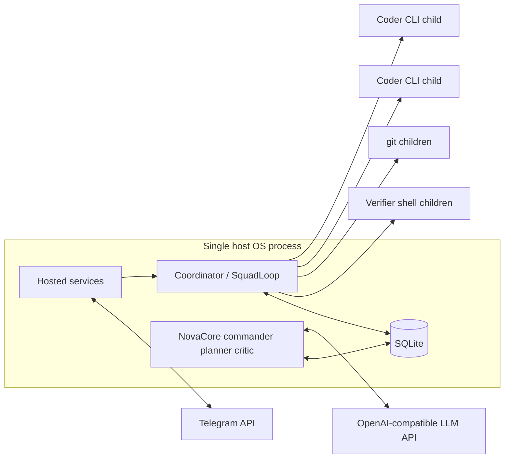
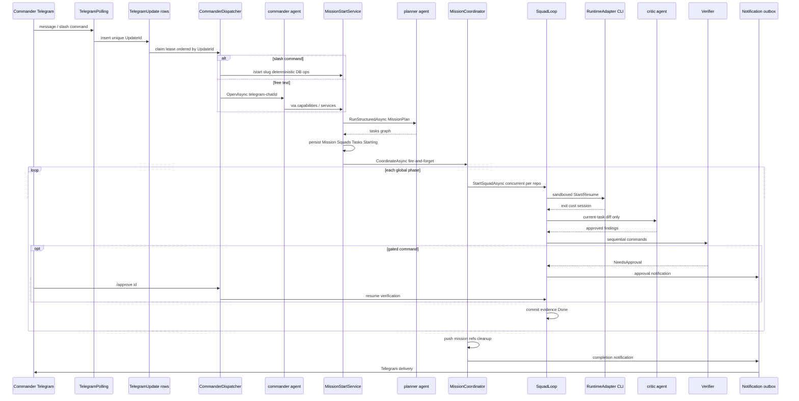
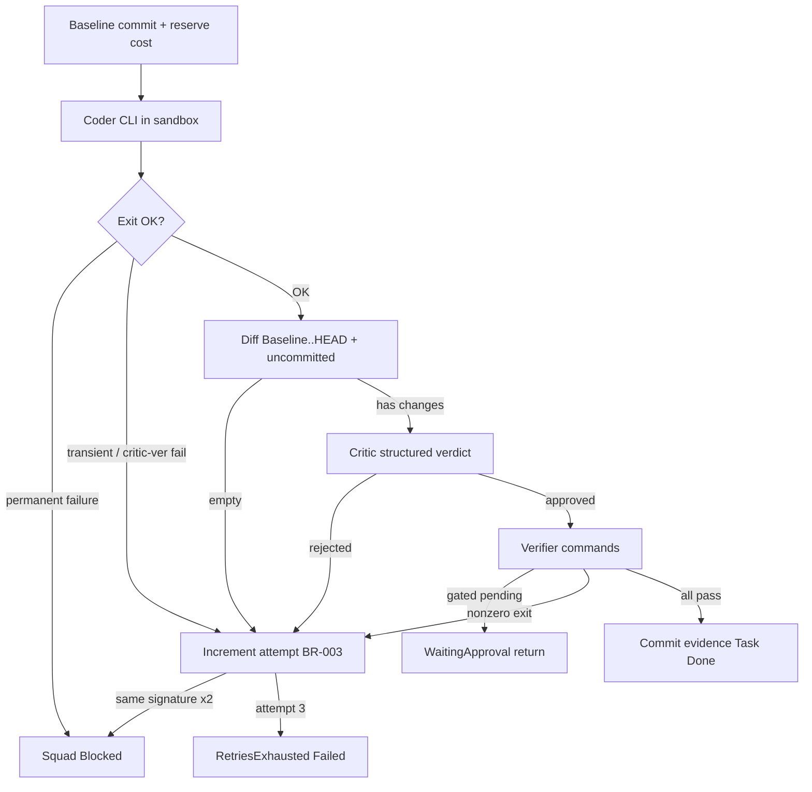
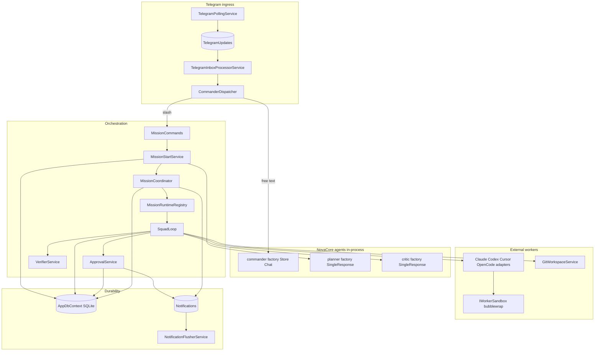
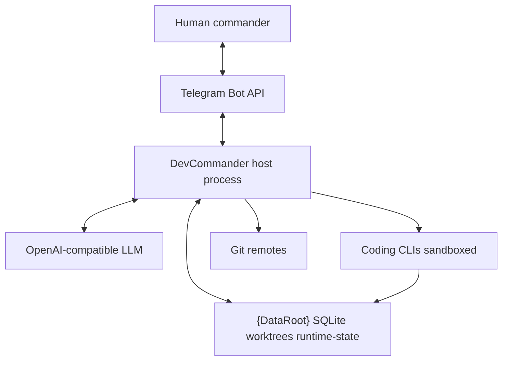

# DevCommander architecture

This document describes the running process model, end-to-end workflow, modules, how they are wired, the coder prompt, and the durable LLM cost ledger.

## 1. How many processes exist?

### Always-on: one host OS process

DevCommander runs as **one** ASP.NET Core process (`dotnet DevCommander.dll` / the Docker container entrypoint). All hosted services, DI singletons, SQLite access, NovaCore agents, and orchestration live **inside that process** as threads / async tasks — not as separate OS processes.

| In-process hosted service | Role |
|---|---|
| `DatabaseInitializerHostedService` | Create paths, migrate SQLite, verify WAL (blocks other hosted starts) |
| `RuntimeCapabilityProbeHostedService` | Probe bubblewrap + mark runtimes available/unavailable |
| `StartupReconciliationService` | Resume non-terminal missions; queue recovery summary |
| `TelegramPollingService` | Long-poll Telegram → durable inbox rows |
| `TelegramInboxProcessorService` | Lease/process inbox → dispatcher |
| `NotificationFlusherService` | Deliver outbox rows to Telegram |

### On-demand child OS processes

The host spawns **short-lived child processes** via `IProcessRunner` when work requires them:

| Child process | When | Isolation |
|---|---|---|
| Coding CLI (`claude` / `codex` / `agent` / `opencode`) | Each coder attempt | Wrapped by `IWorkerSandbox` (Linux `bubblewrap`) |
| Verifier shell (`/bin/sh -c …` or `cmd.exe /c …`) | Each verification command | Host-side (not worker sandbox) |
| `git` | Clone, worktree, diff, commit, push | Host-side, per-repo serialized |

**Count at runtime:**

- Idle container: **1** OS process (host).
- Mission with *N* repos in the same phase, each running a coder: **1 + N** OS processes (host + *N* sandboxed CLIs), plus occasional git/verifier children.
- Squads for one repo run **serially**; same-phase squads across repos run **concurrently**.



---

## 2. End-to-end workflow



### Phase rules

1. Planner assigns integer `phase` per task (positive, contiguous from 1).
2. Coordinator starts all eligible squads for the **lowest unfinished** phase.
3. Same-phase work across repositories runs **concurrently**.
4. Tasks for one squad run **serially**.
5. Phase *N+1* waits until every task in phase *N* is `Done`.
6. On full success: host pushes `HEAD:refs/heads/mission/{repoId}/{missionSlug}`, removes worktrees, queues one completion notification.

### Per-task loop (Coder → Critic → Verifier)



---

## 3. Components / modules working together



| Folder / module | Responsibility |
|---|---|
| `Integrations/Telegram` | Poll, inbox, dispatcher, messenger, outbox flusher |
| `Agents` | Keyed NovaCore factories + `RegisterRepository` capability |
| `Missions` | Spec parse/validate, start, planner |
| `Orchestration` | Commands, coordinator, registry, squad loop, critic, verifier, approval |
| `Runtimes` | Adapter contract + four CLI parsers |
| `Sandbox` / `Process` | bubblewrap wrapper + process tree kill / bounded capture |
| `Git` | Per-repo locked clone/worktree/diff/commit/push |
| `Data` / `Domain` | EF entities, migrations, WAL initializer |
| `Services` | Mission budget (`ICostAccountingService`), unified LLM cost ledger (`IAgentCostTracker`), state transitions, outbox, reconciliation, probes, repos |
| `Options` / `Workspace` | Config validation, `DataRoot` paths |

---

## 4. How they are defined (wiring)

Everything is registered in [`Program.cs`](../src/DevCommander/Program.cs) as ASP.NET Core DI:

| Kind | Examples | Lifetime |
|---|---|---|
| Options | `DevCommanderOptions`, `TelegramOptions` + `IValidateOptions` | Singleton options |
| Paths / time | `IRuntimePaths`, `TimeProvider.System` | Singleton |
| EF | `IDbContextFactory<AppDbContext>`, scoped `AppDbContext`, `AddDefaultEfCorePersistence` | Factory / scoped |
| Pricing | `IPricingSource` composite host + `BuiltIn` | Singleton |
| Process / sandbox / git | `IProcessRunner`, `IWorkerSandbox`, `IGitWorkspaceService` | Singleton |
| Runtimes | Four `IRuntimeAdapter` → `RuntimeRegistry` | Singleton |
| Domain services | Mission start/planner/critic/verifier/approval/budget cost/agent cost tracker/coordinator/registry/commands | Singleton |
| NovaCore | `AddModelProfiles` + keyed `AddAgentFactory("commander"|"planner"|"critic")` | Singleton factories |
| Hosted | DB init → probe → reconciliation → Telegram poll → inbox → outbox | Hosted service order |

Agent factories ([`AgentRegistration.cs`](../src/DevCommander/Agents/AgentRegistration.cs)):

- **commander**: `.Store()` (EF conversations), `LoopMode.Chat`, 25 tool rounds, summarize every 10 / keep 10.
- **planner / critic**: no store, `LoopPolicy.SingleResponse`, `RunStructuredAsync<T>()`.
- Consumers must inject `[FromKeyedServices("…")] IAgentFactory` — never unkeyed.

Interfaces are the contracts; concrete types are the implementations registered above (e.g. `ISquadLoop` → `SquadLoop`).

---

## 5. Coder prompt

The coding CLI is **not** a NovaCore agent. `SquadLoop` builds a plain string and passes it to `IRuntimeAdapter.StartAsync` / `ResumeAsync` as `RuntimeRunRequest.Prompt`.

Defined in [`SquadLoop.BuildPrompt`](../src/DevCommander/Orchestration/SquadLoop.cs):

```csharp
private static string BuildPrompt(Mission mission, Squad squad, TaskItem task) =>
    $"Mission:\n{mission.SpecContent}\n\nTask:\n{task.Description}\n\nGuidance:\n{squad.LastGuidance}";
```

So the coder receives three blocks:

1. **Mission** — full immutable locked mission file content (`Mission.SpecContent`, already snapshotted at start).
2. **Task** — current `TaskItem.Description` from the planner.
3. **Guidance** — optional `Squad.LastGuidance` from `/continue … [guidance]` (may be null/empty).

The SRS also calls for repo `AGENTS.md`, prior-phase summaries, and retry evidence in the coder context. The current implementation’s prompt is the three-block string above; phase summaries are persisted on tasks/mission for coordination, and retry evidence is stored on the task ledger (`Evidence`, `LastErrorSignature`) for status/debug rather than being appended into this prompt today.

Adapter-specific invocation (prompt as CLI argument / stdin per runtime): Claude `-p`, Codex `exec`, Cursor `agent -p`, OpenCode `run` — see `Runtimes/RuntimeAdapters.cs`.

### Related NovaCore prompts (not the coder)

| Agent | Instructions constant |
|---|---|
| commander | `"You are DevCommander. Coordinate missions and repositories using capabilities. Never edit repository files."` |
| planner | `"Produce a complete, valid MissionPlan only. Every listed repository needs at least one task."` |
| critic | `"Review only the supplied current-task diff. Return an approval verdict with concrete blocking findings."` |

---

## 6. LLM cost ledger

Two related systems:

| System | Purpose |
|---|---|
| `ICostAccountingService` + `Mission.AccountedCostUsd` | **Budget gate** for coding CLI runs: reserve estimate before spawn, reconcile after |
| `IAgentCostTracker` + `AgentCostEntries` | **Durable ledger** of all LLM spend for reporting (`/costs`) |

### What is recorded

| Role | When | Amount | Accuracy |
|---|---|---|---|
| `commander` | After each Telegram free-text supervisor turn | NovaCore `ExecutionReport.TotalCost` / `LlmCost` + tokens | Exact |
| `planner` | After mission plan `RunStructuredAsync` | Same | Exact |
| `critic` | After each critic review | Same | Exact |
| `coder:{Runtime}` | After each coder attempt (post-reconcile) | Reported CLI cost if present, else reserved estimate | Best-effort when unmetered / estimated |

`IsEstimated` is stored per row. Host agents are always `false`; coding rows are `true` when the runtime did not report an authoritative cost (or reported an estimated usage-derived figure).

### `/costs` breakdown

Deterministic Telegram command (no agent call). Example shape:

```text
commander: runs=3 $0.001234 llm=$0.001234 in=… out=… (exact)
planner: runs=1 $0.002000 … (exact)
critic: runs=2 $0.001500 … (exact)
coder:Claude: runs=4 $2.000000 (best-effort)
host LLM (commander/planner/critic): $0.004734
coding agents: $2.000000 (best-effort where unmetered)
total: $2.004734
```

Grand total = host LLM exact + coding ledger lines. Mission budget (`AccountedCostUsd`) is **not** increased by commander/planner/critic rows today; it still only tracks coder reservations for gating.

### Wiring

- [`AgentCostTracker`](../src/DevCommander/Services/AgentCostTracker.cs) — persist + `GetReportAsync`
- [`CommanderDispatcher`](../src/DevCommander/Integrations/Telegram/CommanderDispatcher.cs) — records commander; `/costs` → `MissionCommands.AgentCostsAsync`
- [`MissionPlanner`](../src/DevCommander/Missions/IMissionPlanner.cs) / [`CriticService`](../src/DevCommander/Orchestration/CriticService.cs) — record with `MissionId` when known
- [`SquadLoop`](../src/DevCommander/Orchestration/SquadLoop.cs) — `RecordCoderAsync` after `ReconcileAsync`

Telegram free-text replies send **only** the commander message text (not the full `ExecutionOutcome` / report dump).

---

## Context diagram (system boundary)


