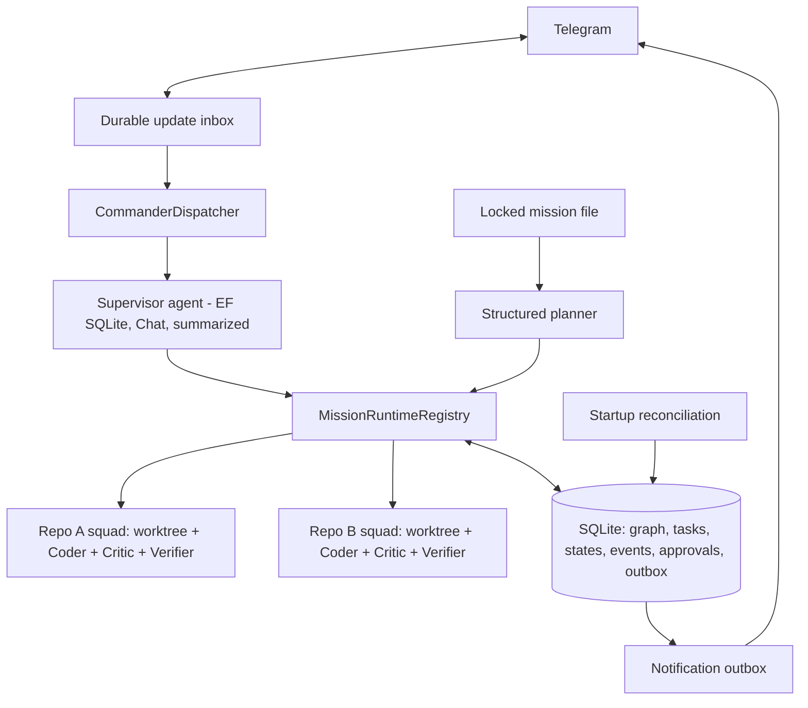

# DevCommander — Software Requirements Specification

**Version:** 1.1 (locked) · **Date:** 2026-07-14 · **Status:** Approved for build
**Stack:** .NET 10 · NovaCore.Agents 3.1.7 · SQLite · Docker on home server

---

## 1. Purpose & Scope

DevCommander is a personal autonomous-coding control plane. The human commander talks only to a supervisor through Telegram. The supervisor validates and decomposes a locked multi-repository mission, starts one disposable coding squad per repository, coordinates global dependency phases, and reports only completion or intervention events.

**In scope:** multi-repository mission graphs, four coding runtimes, Coder→Critic→Verifier execution, durable recovery, strong worktree isolation, approval gates, budget accounting, and durable notifications.
**Out of scope:** authoring missions, CI/CD, PR review UI, multi-user tenancy, MCP integrations, and container-per-task isolation.

## 2. Stakeholders

| Role | Who | Interaction |
|---|---|---|
| Commander | One allowlisted user | Telegram goals, status, approvals, stop/continue, and course correction |
| Supervisor | NovaCore `"commander"` agent | Conversational control plane; delegates all code changes |
| Squad | One coding CLI worker for one mission repository | Never addressed directly by the commander |

## 3. System Context

- **Host:** one Linux Docker container with a persistent `{DataRoot}` volume containing SQLite, mission files, repository clones, worktrees, and runtime session state.
- **Tools:** .NET SDK, git, `claude`, `codex`, Cursor `agent`, and `opencode`.
- **References:** reuse the host patterns from JobAssistant and `RunBudget`, `RunStructuredAsync<T>`, model profiles, and EF conversation persistence from NovaCore.Agents.
- **Pilot repositories:** `Wincora.Infrastructure` and `Wincora.Nexus`.
- **Mission source:** one immutable file at `{DataRoot}/missions/{missionSlug}.md`. Repositories contain only their own `AGENTS.md`.

## 4. Architecture

**Components:** CommanderDispatcher · durable Telegram inbox · supervisor factory `"commander"` · planner factory `"planner"` · critic factory `"critic"` · MissionRuntimeRegistry · four runtime adapters · verifier · approval service · startup reconciliation · notification outbox · EF/SQLite store.

**Mission coordination:** the planner returns tasks with `{repoId, phase, description}`. Squads for different repositories may execute tasks in the same phase concurrently. Phase `N+1` starts only after every required task in phase `N` succeeds; phase summaries become downstream context.

## 5. Functional Requirements

**Repositories and missions**
- FR-001: Register a repository from Telegram through the supervisor's `RegisterRepository` capability with a server path or clone URL, default branch, default runtime, verification commands, and gated-operation patterns.
- FR-002: Start only from a locked mission file containing every required non-empty section and one valid verification subsection per listed repository; otherwise name all invalid or missing sections and spawn nothing.
- FR-003: Snapshot the accepted mission content and hash, run structured decomposition, validate the plan, and persist the entire task graph before spawning any worker.
- FR-004: Run independent repository squads and same-phase tasks concurrently; run dependent phases sequentially with upstream summaries.

**Execution**
- FR-010: Run each coder headlessly in a dedicated mission worktree and branch through a runtime-specific strong sandbox.
- FR-011: Select runtime in this order: explicit mission repository override, mission default, repository default. Reject unavailable or invalid runtimes before spawn.
- FR-012: After each coder attempt, review only the current task's changes with a one-shot structured Critic verdict `{approved, blockingFindings[], notes}`.
- FR-013: After Critic approval, execute the effective repository verification commands; process exit code is the sole pass signal.
- FR-014: On Critic or verification failure, retry the same task with findings and verifier output while attempts remain.
- FR-015: On task pass, record evidence and a durable git checkpoint. On repository completion, commit and push the explicit mission ref. On mission completion, emit one completion notification.

**Command and control**
- FR-020: Answer status requests from SQLite, never from worker context.
- FR-021: `StopSquad` kills the complete worker process tree and preserves state/worktree. `ContinueMission` resumes stopped or blocked work from the ledger when attempts remain.
- FR-022: Before a host-controlled gated command runs, atomically create an `ApprovalRequest`, set the squad to `WaitingApproval`, enqueue a notification, and return from the loop. Only `/approve {approvalId}` may resume that exact command.

**Durability and recovery**
- FR-030: Persist mission graph, immutable spec snapshot, task attempts, squad checkpoints, approvals, events, Telegram inbox, and notification outbox in SQLite. Persist only supervisor conversations in NovaCore agent tables; coding CLI context is recoverable from native session state or the ledger.
- FR-031: On startup, reconcile non-terminal missions, process identity, worktrees, git checkpoints, approvals, inbox items, and outbox rows without reworking completed tasks.
- FR-032: Retry explicitly transient worker/git failures with bounded exponential backoff and jitter. Keep Telegram failures inside the outbox. Permanent configuration/auth/ref conflicts become `Blocked`.
- FR-033: Attempt native resume with the recorded runtime session and unchanged worktree. If the session is unavailable, fresh-spawn from the immutable spec, current-task ledger, task baseline diff, and upstream summaries.

**Notifications**
- FR-040: Notify only on mission completion, blocked/approval-needed, retries exhausted, budget/wall-time breach, and post-recovery summary. Tool progress and all other actions are recorded as `SquadEvent`, not sent to Telegram.

## 6. Business Rules

- BR-001: A mission file is valid only when these seven headings have non-empty bodies: Repositories, Goal, In-scope, Out-of-scope, Verification commands, Acceptance criteria, Runtime preference. `Verification commands` must contain exactly one `### {repoId}` subsection per listed repository; each subsection is `repo default` or a non-empty command list.
- BR-002: Worker tools and shell commands may access only their assigned worktree, a private per-squad runtime home containing no host secrets, and the minimum git metadata required for that worktree. All other data roots, repositories, worktrees, and host credentials are absent from the sandbox. A runtime without a verified sandbox is unavailable.
- BR-003: Each `TaskItem` has at most three coder attempts. The same normalized failure signature twice blocks the task for human guidance; after three failed attempts the task is `RetriesExhausted` and cannot auto-continue.
- BR-004: Every mission has a configurable budget (default $5) and wall-time cap. Metered costs are exact; runtimes without authoritative telemetry use configured best-effort reservations/estimates. No run starts when its reserved charge exceeds the remaining budget. Wall-time cancellation applies to in-flight work.
- BR-005: Verifier exit code overrides every LLM self-assessment.
- BR-006: `Repo.GatedOps` contains case-insensitive substring patterns matched against the full verifier command after trimming and collapsing whitespace. A match requires a single-use approval bound to `{missionId, squadId, taskId, attempt, commandIndex, commandHash}` with states `Pending → Approved → Executing → Consumed`. A crash in `Executing` blocks for human reconciliation; it never auto-replays.
- BR-007: Workers receive no deploy or git-push credentials. Only the host git service may push, using `HEAD:refs/heads/mission/{repoId}/{missionSlug}`; main/master and force pushes are rejected.
- BR-008: The supervisor has orchestration capabilities only and never edits repository files.
- BR-009: Mission, task, event, approval, and outbox changes caused by one transition are committed in one SQLite transaction using an expected-state/version check.

## 7. Non-Functional Requirements

| ID | Requirement | Target |
|---|---|---|
| NFR-01 | Recovery | 100% of non-terminal missions resumable; zero completed-task rework |
| NFR-02 | Startup reconciliation | First recovery summary queued within 60 seconds |
| NFR-03 | Status latency | Database-backed response within 5 seconds |
| NFR-04 | Supervisor context | Summarize at least every 10 turns; retain 10 recent turns |
| NFR-05 | Budget control | Mandatory default $5; exact for reported usage, explicitly best-effort for unmetered usage |
| NFR-06 | Concurrency | At least three squads run concurrently without worktree or database-state interference |
| NFR-07 | Observability | Every squad action produces a `SquadEvent`; NovaCore OTel remains optional |
| NFR-08 | Security | Chat allowlist, strong worker sandbox, sanitized environment, host-only push/deploy credentials, audited approvals |
| NFR-09 | Availability | Daemon and durable queues survive internet loss indefinitely |

## 8. Data Model

| Entity | Required fields |
|---|---|
| `Repo` | Id (slug PK), Source, DefaultBranch, DefaultRuntime, VerifyCommands, GatedOps |
| `Mission` | Id (Guid), Slug (unique), SpecPath, SpecHash, SpecContent, Status, BudgetUsd, AccountedCostUsd, Deadline, ChatId, Version, CreatedAt, ClosedAt |
| `Squad` | Id, MissionId, RepoId, WorktreePath, Branch, BaseCommit, Runtime, Status, LastPid, ProcessStartedAt, SessionId, CurrentTaskId, Version |
| `TaskItem` | Id, MissionId, SquadId, Phase, Description, Status, AttemptCount, LastErrorSignature, BaselineCommit, Evidence |
| `SquadEvent` | Id, SquadId, Kind, Payload, At |
| `ApprovalRequest` | Id, MissionId, SquadId, TaskId, Attempt, CommandIndex, CommandHash, Operation, State, RequestedAt, DecidedAt, DecidedByChatId |
| `Notification` | Id, ChatId, LogicalKey (unique), Severity, Body, State, AttemptCount, NextAttemptAt, LastError, At, SentAt |
| `TelegramUpdate` | UpdateId (PK), ChatId, Payload, State, ReceivedAt, ProcessedAt |
| `AppSetting` | Key (PK), Value |
| NovaCore tables | `agent_sessions`, `agent_messages`, `agent_memories` for supervisor chat only |

### Status model

| Aggregate | Values and legal progression |
|---|---|
| `MissionStatus` | `Planning → Planned → Starting → Running`; `Running ↔ Blocked`; `Running ↔ Stopped`; `Running → Completed | Failed | Halted`. `Completed`, `Failed`, and `Halted` are terminal. |
| `SquadStatus` | `Pending → Starting → Running`; `Running ↔ WaitingApproval | StalledNetwork | Blocked`; `Running → Stopping → Stopped`; `Stopped → Starting`; `Running → Completed | Failed | Halted`. `Completed`, `Failed`, and `Halted` are terminal. |
| `TaskStatus` | `Pending → Running`; `Running ↔ WaitingApproval | Blocked`; `Running → Done | RetriesExhausted`. `Done` and `RetriesExhausted` are terminal. |

Mission status is the current-phase aggregate: a required blocked/stopped squad makes the mission `Blocked`/`Stopped`; task retry exhaustion makes it `Failed`; budget or deadline breach makes it `Halted`; all tasks done makes it `Completed`.

## 9. External Interfaces

| Interface | Contract |
|---|---|
| Telegram | `/missions`; `/start {missionSlug}`; `/status {missionSlug}`; `/approve {approvalId}`; `/stop {missionSlug} {repoId}`; `/continue {missionSlug} {repoId} [guidance]`; `/whoami`; free text → supervisor |
| Register repository capability | `RegisterRepository { repoId, source, defaultBranch, defaultRuntime, verifyCommands[], gatedOps[] }` |
| Planner | `MissionPlan { tasks: PlannedTask[] }`; `PlannedTask { repoId, phase, description }`; tasks non-empty, repo registered/listed, phases positive and contiguous |
| Runtime adapter | `Start/Resume(RuntimeRunRequest, onStarted, ct) → RuntimeResult`; start callback exposes PID immediately; cancellation kills the process tree |
| Runtime result | SessionId, FinalMessage, ExitCode, CostUsd?, Usage?, FailureKind; parsers ignore unknown fields |
| Verifier | Sequential shell execution of effective commands in worktree; bounded stdout/stderr captured as evidence |
| Git | Per-repository serialized clone/fetch/ref/worktree operations; explicit branch `mission/{repoId}/{missionSlug}` and push refspec |

## 10. State and Workflow Rules

1. `/start` durably inserts a unique Telegram update, atomically creates-or-returns a `Planning` mission, initializes `BudgetUsd` from `DevCommanderOptions.DefaultBudgetUsd` (default `5.0`) and `Deadline` from `TimeProvider.GetUtcNow() + DefaultMissionWallTime`, validates/snapshots the file, persists validated tasks/squads as `Planned`, then conditionally transitions to `Starting`.
2. Each squad captures a task baseline commit, starts the sandboxed coder, persists PID, and reviews `baseline..HEAD` plus uncommitted changes. Earlier completed-task changes are excluded.
3. Critic or verifier failure increments that task's attempt count and records a normalized signature. Duplicate signature → `Blocked`; third failure → `RetriesExhausted`.
4. A gated verifier command writes approval, squad state, event, and outbox atomically, then returns and releases the squad gate. Approval conditionally resumes it once.
5. Task success records verification evidence and git checkpoint atomically. Repository completion pushes explicitly; mission completion is committed with its outbox notification.
6. `/stop` transitions `Running → Stopping → Stopped`, kills and awaits the process tree, and prevents late worker completion from overwriting the stopped state.
7. Reconciliation adopts only worktrees and processes whose persisted identity matches. It completes interrupted durable transitions from recorded commits; it never reruns a completed task.
8. Outbox delivery is at-least-once. Unique logical keys prevent duplicate enqueue; a lease prevents concurrent sends. Telegram acknowledgement ambiguity may still produce duplicate delivery.

## 11. Acceptance Criteria

- One observable test per FR is required.
- Missing or empty mission sections prevent planning/spawn and are named in the reply.
- Two repositories with same-phase tasks run concurrently; the next phase waits for both and receives their summaries.
- The third failed task attempt becomes `RetriesExhausted`; a repeated signature blocks after the second.
- A no-op attempt after a completed earlier phase is still detected using the task baseline.
- Coder success plus non-zero verifier exit retries the task.
- Worker attempts to access a sibling worktree or receive push/deploy credentials fail.
- Gated execution requires a matching single-use approval; `Executing` after a crash never auto-replays.
- Crash checkpoints preserve completed tasks and queue a recovery summary within 60 seconds.
- Three concurrent squads, Telegram inbox processing, and outbox flushing do not lose state under SQLite contention.

## 12. Constraints & Assumptions

- Confirmed: one commander, one container, SQLite, central multi-repository mission files, all four adapters, strong sandboxing, DB approval gates, and best-effort cost accounting where telemetry is unavailable.
- The container is Linux; development build/tests remain cross-platform.
- Strong isolation is implemented with `bubblewrap`: read-only system mounts, one read/write worktree, one private per-squad runtime home, minimum worktree-specific git metadata, private `/tmp`, shared network, and no mount of the remaining `{DataRoot}`. Unprivileged user namespaces must be enabled; probe failure makes runtimes unavailable.
- CLI credentials and persistent native session state live outside git/SQLite. Worker environments are allowlisted and exclude host git/deploy credentials.
- A runtime failing installation, authentication, headless, or sandbox capability probes is reported unavailable; DevCommander does not silently weaken isolation.

## 13. Architectural Decisions

- ADR-001: NovaCore.Agents for supervisor/planner/critic — Accepted.
- ADR-002: Coding workers are external CLI subprocesses — Accepted.
- ADR-003: Durability is SQLite + git checkpoints + task ledger — Accepted.
- ADR-004: Critic is a one-shot structured NovaCore agent; readonly-CLI escalation is optional and out of scope — Accepted.
- ADR-005: SQLite replaces SQL Server for the single-node deployment — Accepted.
- ADR-006: Approval gates use a transactional database state machine, not `SuspendsForHost` — Accepted.
- ADR-007: One mission file coordinates multiple repository squads through global integer phases — Accepted.
- ADR-008: Cost accounting is exact when reported and explicitly best-effort otherwise — Accepted.
- ADR-009: Strong runtime sandboxing is mandatory; unavailable is safer than fallback — Accepted.

## 14. Open Operational Questions

| Question | Owner | Build blocking? | Required behavior |
|---|---|---|---|
| Headless authentication for Cursor and OpenCode in the target image | Deployment operator/vendor | No | Adapter ships; failed probe marks runtime unavailable |
| Subscription versus API-key use for Claude/Codex | Deployment operator/provider terms | No | Credentials supplied at deployment, never persisted by DevCommander |

**Quality gate:** requirements and prompt must agree; state transitions are explicit; every FR has an observable test; no implementation step may weaken BR-002, BR-006, or BR-007.
