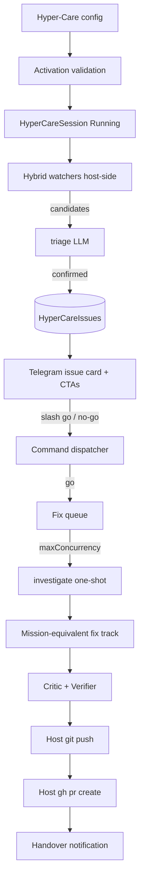

# DevCommander — Hyper-Care Mode Software Requirements Specification

**Version:** 1.1 · **Date:** 2026-07-23 · **Status:** Accepted  
**Parent:** [devcommander-srs.md](devcommander-srs.md) v1.1 (locked coding plane)  
**Stack:** .NET 10 · NovaCore.Agents · EF Core SQLite · Telegram.Bot · Grafana HTTP API · Azure `az` CLI · GitHub `gh`  
**Telegram UX reference:** [Telegram Bot Features](https://core.telegram.org/bots/features)

---

## 1. Purpose & Scope

Hyper-Care Mode is an **exclusive** long-running operating mode of the same DevCommander host process. While active, DevCommander multiplies one engineer’s impact during go-lives and large multi-service changes by watching many services in parallel, deduplicating live failures into session issues, obtaining a human **go / no-go** per issue, and driving investigation → implementation → critic → verify → push → **GitHub PR** handover — without deploying.

**In scope:** mode activation/deactivation and crash recovery, config validation, hybrid watchers (Grafana + Azure checks), LLM false-positive triage, issue queue with concurrency caps, go/no-go + severity/priority/hold controls, reuse of coding squad machinery (one fix track per go; investigate replaces planner), host `gh` PR creation, end-to-end structured logs and durable events, session cost/concurrency gates.

**Out of scope:** auto-deploy / merge / live cutover; automatic “environment stable” exit; mode-switch automation when normal missions are running (operator responsibility); accurate catch-rate measurement product; MCP; App Insights / CloudWatch; Mini Apps; multi-user tenancy; parallel workers on a single issue; distributed tracing export (OTel) as a v1 requirement (optional follow-on).

**Amends parent SRS by reference:** notification sparsity (**FR-040**) is expanded while Hyper-Care is active (issue cards and decision CTAs); parent **out of scope** “CI/CD” remains (no deploy); PR creation via host `gh` is new host capability, not worker capability. Parent gated-verifier approvals (**BR-006**) still apply during fix tracks and may produce additional approval CTAs; those are not a second issue go/no-go.

---

## 2. Stakeholders & Personas

| Role | Who | Interaction |
|---|---|---|
| Commander | One allowlisted Telegram user | Activate/deactivate Hyper-Care; go/no-go; severity; priority/hold; receive issue and handover cards; gated verifier approvals when applicable |
| Hyper-Care coordinator | Deterministic hosted orchestration (not an LLM agent) | Session lifecycle, queue, concurrency, handover, recovery |
| Hybrid watcher | Host-side non-LLM process per watch target (or pool) | Ingest → filter → candidate → triage handoff |
| Triage agent | NovaCore one-shot `triage` | Confirm / reject false positives on filtered candidates |
| Investigate agent | NovaCore one-shot `investigate` | Root-cause brief + fix-task text for a Go issue (replaces planner for Hyper-Care tracks) |
| Coding squad | Existing sandboxed coder CLI + Critic + Verifier | Exactly one fix track per Go issue |
| External systems | Grafana, Azure, GitHub | Logs/metrics, CLI checks, PR |

---

## 3. System Context

### 3.1 Current coding plane (parent)

Single ASP.NET host, SQLite durability, Telegram ingress/outbox, NovaCore `commander` / `planner` / `critic`, sandboxed coding CLIs, `MissionCoordinator` + `SquadLoop` ([architecture.md](architecture.md), parent SRS). Push today: `HEAD:refs/heads/mission/{repoId}/{missionSlug}` only — no `gh`, no Grafana/Azure.

### 3.2 Hyper-Care addition

**Exclusivity:** Process mode is either **Normal** (parent missions) or **HyperCare**. Not both. How the operator clears normal work before activation is out of scope.

**Trust split:** Grafana token, Azure identity, and `gh` auth exist only on the host watcher/handover path. Coding workers remain under parent **BR-002** / **BR-007** (no cloud/deploy/`gh` secrets in the sandbox).

---

## 4. Goals & Non-Goals

**Goals**
- G-01: Parallel observation of many services in one Hyper-Care session.
- G-02: High-signal issues (imperative noise filter, then LLM FP check).
- G-03: Human decides only go/no-go (plus severity/priority as needed); system executes the fix track through PR. Gated verifier approvals remain a separate parent control.
- G-04: Concurrent fix tracks up to configured `maxConcurrency`; excess queued.
- G-05: Handover = pushed branch + GitHub PR URL; human owns merge/deploy.
- G-06: Debuggable end-to-end: every module emits structured logs and durable events (distributed traces optional follow-on).

**Non-goals**
- NG-01: Auto-deploy or merge.
- NG-02: KPI dashboards or ground-truth catch-rate accounting.
- NG-03: Separate Hyper-Care OS process.
- NG-04: Multiple concurrent fix tracks for one issue.
- NG-05: Multi-repo mapping per service in v1 (exactly one `repoId` per service).

---

## 5. Success Metrics (north star)

| ID | Metric | Role | Measurement |
|---|---|---|---|
| SM-01 | Caught issues ÷ total issues | North star | Not productized; no ground-truth subsystem required |
| SM-02 | Effectively fixed (HandedOver) ÷ caught | North star | Derivable from session issue statuses if inspected; not a reporting feature |

Durable counters useful for later inspection (not a metrics product): issues by status, occurrence counts, queue wait, fix duration, triage accept/reject.

---

## 6. Functional Requirements

### Mode and configuration

- **FR-HC-001:** Provide a durable process mode `Normal | HyperCare`, persisted (e.g. `AppSetting` or session row) so restart restores it. While `HyperCare`, refuse parent mission starts (`/start {slug}` and equivalent supervisor capabilities) with an explicit message that Hyper-Care is active.
- **FR-HC-002:** Activate Hyper-Care only after loading session configuration from the default path `{DataRoot}/hypercare/config` (or a single documented override path) and passing validation (FR-HC-003). On success, persist session `Running`, set mode `HyperCare`, and start watchers.
- **FR-HC-003:** Activation validation fails closed when any required element is missing, unreadable, unauthorized, or conflicting (duplicate service ids, unknown `repoId`, service mapped to zero or more than one `repoId`, `maxConcurrency < 1`, Grafana unreachable/unauthorized, Azure CLI identity unusable when Azure checks are configured, `gh` auth unusable, empty service list, missing redaction config when prod profile requires it). Reply names every failing check.
- **FR-HC-004:** Deactivate Hyper-Care on explicit operator command: stop watchers; reject further `/go`, `/nogo`, `/severity`, `/priority`, and `/hold` for all issues in that session; leave in-flight fix tracks to finish or be stopped by parent `/stop` semantics; persist session `Stopped` and mode `Normal`. Existing `AwaitingDecision` issues remain frozen (status unchanged, no further decision prompts).
- **FR-HC-005:** Required configuration at activation includes: service list (id, watch targets), Grafana integration (base URL + auth env var name + log/metric query bindings per service), Azure check definitions (optional per service but validated if present), repository mapping (**exactly one** registered `repoId` per service), `maxConcurrency`, session budget USD, default severity, default priority, triage/investigate/coder runtime preferences as applicable.
- **FR-HC-006:** On host startup, if a `HyperCareSession` is `Running` (or durable mode is `HyperCare`): restore mode `HyperCare`; resume watchers from the snapshotted config; reconcile in-flight fix tracks using parent mission/squad reconciliation patterns (no rework of completed tasks); re-queue eligible `Queued`/`Held` issues; enqueue one recovery summary within 60 seconds (align parent NFR-02).

### Surveillance (hybrid watchers)

- **FR-HC-010:** For each configured watch target, run a host-side hybrid watcher that ingests Grafana signals (logs and metrics via Grafana HTTP API) and configured Azure `az` checks.
- **FR-HC-011:** Apply imperative filters first to drop noise. Do not call the triage LLM for filtered-out lines/events.
- **FR-HC-012:** When a candidate matches configured criteria, send a bounded suspicious context (not the raw firehose) to the `triage` agent for false-positive judgment `{confirmed, reason, normalizedSignature, summary}`.
- **FR-HC-013:** On triage `confirmed`, create or update a session issue keyed by `(sessionId, serviceId, normalizedSignature)` (FR-HC-020). On reject, record a durable triage-reject event only (no Telegram issue card).

### Issues and notifications

- **FR-HC-020:** An issue is unique per `(sessionId, serviceId, normalizedSignature)`. Repeated hits increment `OccurrenceCount` and refresh attributes (last seen, sample snippets); they do not create a second issue.
- **FR-HC-021:** On first create of a non-suppressed issue in `AwaitingDecision`, enqueue one Telegram issue card and persist the Telegram `message_id` on the issue for later edits. Subsequent occurrences update durable state and MAY edit that message (or send a quiet count-only follow-up) per NFR-HC-03 — they must not spam a full new go/no-go prompt each time. If `message_id` is missing, fall back to throttled count-only follow-ups (no claim of edit).
- **FR-HC-022:** Issue card content includes at least: short id, service, summary, **current severity** (session default until changed), occurrence count, first/last seen, key attributes/snippets, status, and CTAs (FR-HC-030). Severity is pre-filled with the session default when the issue is created; the operator may change it via `/severity` before or after `/go` while the issue is non-terminal.
- **FR-HC-023:** No-go marks the issue `Suppressed` for the remainder of the session: no fix track, no further go/no-go prompts for that signature. Occurrence counting may continue for debug.
- **FR-HC-024:** After an issue reaches a terminal status (`Suppressed`, `HandedOver`, `Failed`), further matching events only update `OccurrenceCount` / last-seen. They do **not** reopen go/no-go, create a new issue, or start another fix track in the same session. Opening a new decision requires a new session (or a future explicit reopen command — out of scope for v1).

### Operator CTAs (Telegram)

- **FR-HC-030:** Every actionable Hyper-Care message exposes CTAs that cause the bot to receive the corresponding **slash commands** (see [Telegram Bot Features](https://core.telegram.org/bots/features) — Commands, Keyboards, Inline Keyboards, Menu Button). Implementation SHALL use one or both of: (a) slash commands written in the message body so Telegram highlights them and a tap re-sends the command; (b) reply-keyboard buttons whose button text is exactly the slash command payload. Inline callback buttons MAY be added only if they invoke the **identical** command handlers and the message still shows the slash form for auditability.
- **FR-HC-031:** Register Hyper-Care command list with Telegram (`setMyCommands` / BotFather scopes) while Hyper-Care is active so `/` menu and Menu Button discover them ([Commands](https://core.telegram.org/bots/features#commands), [Menu Button](https://core.telegram.org/bots/features#menu-button)). On `/hc_off`, restore the Normal-mode command list.
- **FR-HC-032:** Support at least these slash commands (names illustrative; must be ≤32 chars, specific — avoid overloaded `/start` for Hyper-Care activation):

| Command | Behavior |
|---|---|
| `/hc_on` | Activate using `{DataRoot}/hypercare/config` (default path) |
| `/hc_off` | Deactivate session per FR-HC-004 |
| `/hc_status` | Session + queue + issue counts + source health from DB |
| `/go {issueId} [severity]` | Accept issue for fix; optional severity override |
| `/nogo {issueId}` | Session suppress |
| `/severity {issueId} {severity}` | Update severity (before or after go; non-terminal only) |
| `/priority {issueId} {n}` | Set queue priority (higher wins) |
| `/hold {issueId}` | Prefer this issue: preempt same-repo running track if needed (FR-HC-042) |
| `/unhold {issueId}` | Clear Held on a preempted track so it becomes eligible again (`Queued`) |

- **FR-HC-033:** Severity values are an ordered enum including at least `low`, `medium`, `high`, `critical`. New issues are created with session **default severity** (config; default `medium` if unset). If `/go` omits severity, keep the issue’s current severity. `/severity` updates non-terminal issues and, for `Queued`/`Held` issues, participates in re-ordering.
- **FR-HC-034:** `/go` on an already-go’d or terminal issue is idempotent: do not start a second fix track (NG-04 / BR-HC-004).
- **FR-HC-035:** New issues receive session **default priority** (config; default `0` if unset). `/priority` updates non-terminal issues and re-orders the queue when status is `Queued` or `Held`.

### Fix queue and execution

- **FR-HC-040:** Go creates exactly one fix track for that issue. The track is a **mission-equivalent** that reuses squad/coder/critic/verifier patterns. **Investigate replaces planner:** do not run the parent `planner` agent for Hyper-Care tracks.
- **FR-HC-041:** At most `maxConcurrency` fix tracks may be `Running` at once. Additional Go issues wait in queue ordered by priority (desc), then severity (desc), then first-seen (asc), unless held.
- **FR-HC-042:** At most one fix track per `repoId` may be `Running`. Others targeting the same repo wait. `/hold {preferredIssueId}`: if another track for the same `repoId` is `Running`, transition that track’s issue to `Held` (pause via parent stop/continue-compatible semantics without completing handover); mark `preferredIssueId` as highest eligibility for that repo when concurrency allows. `/unhold {issueId}` on a `Held` issue returns it to `Queued` with prior priority/severity ordering.
- **FR-HC-043:** Fix track pipeline when claimed: `investigate` (structured brief + task) → synthesize immutable in-DB mission snapshot (FR-HC-046) → sandboxed coder → critic (current-task diff) → verifier commands → host push to Hyper-Care branch → host `gh pr create` → record PR URL → issue `HandedOver`.
- **FR-HC-044:** Branch naming is host-controlled and must not push to `main`/`master` or force-push (parent BR-007). Form: `hypercare/{sessionShort}/{issueShort}`.
- **FR-HC-045:** Deploy, merge, and production cutover are never performed by DevCommander.
- **FR-HC-046:** Synthesize the mission-equivalent from investigate output + service/repo mapping + issue attributes into an immutable in-DB spec snapshot (and task graph). No human-authored seven-section mission markdown file is required for Hyper-Care tracks. The snapshot MUST contain enough task text that the existing thin coder prompt (Mission + Task + Guidance) is sufficient.
- **FR-HC-047:** Parent `/stop {missionSlug} {repoId}` and `/continue` apply to Hyper-Care fix-track missions the same way as Normal missions, subject to Hyper-Care queue rules on resume.

### Observability, cost, and budget

- **FR-HC-050:** Every watcher cycle, triage call, issue transition, queue decision, squad action, push, and `gh` invocation emits structured host logs and a durable session/issue/squad event suitable for end-to-end debug.
- **FR-HC-051:** Record triage, investigate, critic, commander (if used), and coder costs in the unified cost ledger with distinct roles; enforce a session budget gate analogous to mission budget before starting triage calls and coder runs.
- **FR-HC-052:** When a triage or coder reservation would exceed remaining session budget: do not start that call/run; transition session to `BudgetHalted`; stop starting new fix tracks and new triage calls; watchers MAY continue ingest/filter/occurrence updates without LLM; enqueue one budget notification. Operator may `/hc_off` or raise budget via config + documented command if provided later (raise-budget command out of scope for v1 — `/hc_off` only).

---

## 7. Business Rules

- **BR-HC-001:** Process mode is exclusive: `HyperCare` XOR parent mission execution.
- **BR-HC-002:** Issue identity = `(HyperCareSessionId, ServiceId, NormalizedSignature)`; occurrences aggregate on one row.
- **BR-HC-003:** No-go ⇒ `Suppressed` for the session; go/no-go prompts stop for that signature+service.
- **BR-HC-004:** Each Go issue has at most one fix track; never parallelize work on one issue.
- **BR-HC-005:** Active running fix tracks ≤ `maxConcurrency`; overflow queues.
- **BR-HC-006:** Same `repoId`: at most one running fix track; queue + operator hold/preempt/unhold.
- **BR-HC-007:** Handover complete iff branch pushed and PR URL persisted; deploy is human-owned.
- **BR-HC-008:** Grafana/Azure/`gh` credentials are host-only; absent from worker sandboxes (extends parent BR-002 / BR-007).
- **BR-HC-009:** Activation fails closed on incomplete, unauthorized, or conflicting configuration (including not exactly one `repoId` per service).
- **BR-HC-010:** Imperative filter runs before any triage LLM call; firehose is never sent to the LLM.
- **BR-HC-011:** New issues start at session default severity; `/go` without severity keeps current; `/severity` may update non-terminal issues (including before go).
- **BR-HC-012:** Mode-switch automation (force-stop missions, etc.) is out of scope; operator ensures a safe activation context.
- **BR-HC-013:** Terminal issues (`Suppressed`, `HandedOver`, `Failed`) never reopen for decision or a second fix track in the same session.
- **BR-HC-014:** Hyper-Care fix tracks do not invoke the parent planner; investigate + synthesized snapshot replace it.
- **BR-HC-015:** Each service maps to exactly one registered `repoId` in v1.
- **BR-HC-016:** Session budget breach ⇒ `BudgetHalted` per FR-HC-052; no new triage LLM or coder starts until session ends.
- **BR-HC-017:** After `/hc_off`, decision commands for that session are rejected; `AwaitingDecision` issues stay frozen.

---

## 8. Non-Functional Requirements

| ID | Requirement | Target |
|---|---|---|
| NFR-HC-01 | Issue card enqueue after triage confirms | ≤ 30 seconds under normal host load |
| NFR-HC-02 | Filtered noise | 0 triage LLM calls for imperative rejects |
| NFR-HC-03 | Repeat-occurrence Telegram behavior | No full duplicate go/no-go card per hit; at most one edit or batched count update per issue per 60 seconds |
| NFR-HC-04 | Grafana poll/follow default | ≤ 60 seconds between successful query cycles per target (configurable) |
| NFR-HC-05 | Concurrency | Hard cap = session `maxConcurrency`; never exceeded |
| NFR-HC-06 | Observability | 100% of state transitions listed in FR-HC-050 produce structured log + durable event |
| NFR-HC-07 | Status command | `/hc_status` answers from DB within 5 seconds (align parent NFR-03) |
| NFR-HC-08 | Security | Allowlisted chat; host-only cloud/`gh` secrets; sandboxed coders; no main/master/force push |
| NFR-HC-09 | Triage context bound | Suspicious context payload capped (config; default ≤ 32 KiB chars) per candidate |
| NFR-HC-10 | Session lifetime | Remains `Running` until `/hc_off`, fatal host stop, or `BudgetHalted` (still until `/hc_off` to leave mode); no auto-stability exit |
| NFR-HC-11 | Recovery | After restart with Running session: watchers and queue resume; recovery summary queued ≤ 60 seconds |

---

## 9. Data Requirements

| Entity | Ownership | Key fields |
|---|---|---|
| Process mode | Host | `Normal` \| `HyperCare` (durable) |
| `HyperCareSession` | Host | Id, Status (`Running` / `BudgetHalted` / `Stopped`), ConfigHash, ConfigSnapshot, MaxConcurrency, BudgetUsd, AccountedCostUsd, DefaultSeverity, DefaultPriority, ChatId, StartedAt, StoppedAt, Version |
| `HyperCareService` | Session config | ServiceId, Grafana bindings, Azure check specs, **RepoId** (exactly one), Enabled |
| `HyperCareIssue` | Session | Id (short + Guid), ServiceId, Signature, Summary, Severity, Priority, OccurrenceCount, Status, FirstSeenAt, LastSeenAt, AttributesJson, TelegramMessageId?, SuppressReason?, FixTrackMissionId? |
| `HyperCareFixTrack` | Issue | Links to mission/squad ids (reuse), Status, Held, PR URL, Branch, LastError |
| Events | Session/Issue/Squad | Kind, Payload, At (append-only debug trail) |
| Config | `{DataRoot}/hypercare/config` | Validated snapshot hashed into session |

### Issue status model

Single entry after triage confirm:

`AwaitingDecision → Suppressed`  
`AwaitingDecision → Queued → Running → HandedOver | Failed | Blocked`  
`Running → Held → Queued` (via `/unhold` or scheduler rules after preferred work finishes)  
`Queued → Held` is not used; **Held** means a previously running track was preempted.

Terminal: `Suppressed`, `HandedOver`, `Failed`.  
`Blocked` is non-terminal for human follow-up (e.g. `gh` failed after push) but does not auto-create a second track.  
`BudgetHalted` is a **session** status, not an issue status.

### Severity and priority

`low < medium < high < critical`.  
Default severity: config or `medium`.  
Default priority: config or `0` (higher integer = sooner in queue).

---

## 10. External Interfaces

| Interface | Contract |
|---|---|
| Telegram commands | FR-HC-032; CTAs per FR-HC-030; features per [Telegram Bot Features](https://core.telegram.org/bots/features) |
| Grafana HTTP API | Service-account (or equivalent) token from env var named in config; query logs + metrics per service bindings |
| Azure | Host `az` CLI with preconfigured identity; checks as declared in config |
| GitHub | Host `gh pr create` after push; auth via host env / `gh auth`; never passed to workers |
| Triage agent | `RunStructuredAsync` → `{ confirmed: bool, reason: string, normalizedSignature: string, summary: string }` |
| Investigate agent | `RunStructuredAsync` → `{ rootCause: string, affectedRepos: string[], taskDescription: string, notes: string }` |
| Parent reuse | Coder adapters, Critic, Verifier, Approval gates, Git workspace (extended branch naming), cost ledger, startup reconciliation patterns — **not** planner for HC tracks |

---

## 11. Workflows

### 11.1 Activation

1. Operator ensures Normal-mode work is clear (OOS automation).  
2. `/hc_on` → load `{DataRoot}/hypercare/config` → validate (FR-HC-003) → persist session → set mode HyperCare → start watchers → notify ready.  
3. On validation failure → mode remains Normal; list failures; spawn nothing.

### 11.2 Detect → decide

1. Watcher ingests → filter → candidate → triage.  
2. Confirmed → upsert issue by `(session, service, signature)` → if new and not suppressed/terminal → status `AwaitingDecision`, severity=default, priority=default → Telegram card + store `message_id`.  
3. `/nogo` → `Suppressed`.  
4. `/go [severity]` → `Queued` (or `Running` if capacity); optional severity override.  
5. `/severity` / `/priority` on non-terminal issues update fields and re-order if queued/held.

### 11.3 Fix → handover

1. Scheduler claims next eligible issue under concurrency + same-repo rules.  
2. Investigate → synthesize in-DB mission snapshot (FR-HC-046) → SquadLoop (no planner).  
3. On verify pass → push Hyper-Care branch → `gh pr create` → `HandedOver` + Telegram handover card (PR URL).  
4. On retries exhausted → `Failed` + notification. On recoverable host/git/`gh` failure needing human → `Blocked` + notification.  
5. Parent gated verifier commands still require `/approve` (BR-006).

### 11.4 Hold / preempt

1. `/hold {preferred}` while another same-repo issue is `Running` → running issue → `Held` (paused); preferred stays/becomes `Queued` with eligibility preference.  
2. When a slot frees, preferred runs before other same-repo queued items.  
3. `/unhold {heldIssue}` → `Queued`; normal ordering resumes.

### 11.5 Failure paths

| Failure | Behavior |
|---|---|
| Grafana auth/query error | Watcher error event; backoff; do not invent issues; `/hc_status` shows degraded source |
| Triage timeout/error | Bounded retry; then discard candidate with durable error event (no issue) |
| `gh` fails after push | Issue `Blocked` with branch name; notify for human PR open |
| Session budget exhausted | FR-HC-052 `BudgetHalted` |
| Host crash mid-session | FR-HC-006 recovery |

### 11.6 Deactivate

`/hc_off` → FR-HC-004: watchers stop; decision commands rejected; in-flight tracks finish or operator stops them; mode `Normal`.

---

## 12. Edge Cases

| Edge | Expected behavior |
|---|---|
| Empty log window | No candidates; no LLM calls |
| 500 identical exceptions same service | One issue; OccurrenceCount=500; one decision card |
| Same signature on two services | Two issues (key includes serviceId) |
| `/go` twice | Idempotent; still one fix track |
| `/go` after `/nogo` | Reject (no unsuppress in v1) |
| Recurrence after `HandedOver` | Count/last-seen only; no new card or track (FR-HC-024) |
| Unknown issue id | Error reply; no state change |
| Service with ≠1 repoId | Activation fails (FR-HC-003 / BR-HC-015) |
| Severity omitted on `/go` | Keep pre-filled default (or prior `/severity`) |
| `/severity` while `Queued` | Update + re-order queue |
| `/severity` while `Running` | Update field; does not preempt by itself |
| Session `/hc_off` with `AwaitingDecision` | Issues frozen; further `/go`/`/nogo` rejected |
| Session stop with running tracks | Watchers stop; in-flight tracks complete or operator `/stop` |
| Gated verifier mid-fix | Parent approval flow; not an issue go/no-go |

---

## 13. Acceptance Criteria

| Requirement | Given / When / Then |
|---|---|
| FR-HC-001 | Given Hyper-Care Running; When `/start {slug}`; Then refused with Hyper-Care-active message; no mission spawn |
| FR-HC-002 | Given valid config at default path; When `/hc_on`; Then session Running, mode HyperCare, watchers started |
| FR-HC-003 | Given missing Grafana token; When `/hc_on`; Then failure lists Grafana auth; mode stays Normal |
| FR-HC-003 / BR-HC-015 | Given a service with two repoIds; When `/hc_on`; Then activation fails naming the mapping |
| FR-HC-004 / BR-HC-017 | Given Running session with an `AwaitingDecision` issue; When `/hc_off` then `/go {id}`; Then `/go` rejected; issue remains AwaitingDecision frozen |
| FR-HC-006 / NFR-HC-11 | Given Running session and in-flight track; When host restarts; Then mode HyperCare restored, watchers resume, track reconciled, recovery summary ≤ 60s |
| FR-HC-011–012 | Given noisy lines matching drop rules; When watcher runs; Then zero triage calls for those lines. Given criteria match; Then triage called once with bounded context |
| FR-HC-013 / FR-HC-020 | Given same signature on services A and B; When both confirmed; Then two distinct issues |
| FR-HC-020–021 | Given 10 identical confirmed events; When processed; Then one issue OccurrenceCount=10, one initial decision card, `message_id` stored |
| FR-HC-022 / FR-HC-033 | Given new issue; When card sent; Then severity equals session default before any `/go` |
| FR-HC-023 | Given `/nogo {id}`; When further matching events; Then no new go/no-go cards |
| FR-HC-024 | Given HandedOver issue; When matching events continue; Then OccurrenceCount increases; no new go card; no second track |
| FR-HC-030 | Given issue card; When operator uses CTA; Then bot handles the documented slash command payload |
| FR-HC-031 | Given HyperCare active; When user opens `/` menu; Then Hyper-Care commands are listed |
| FR-HC-034 / BR-HC-004 | Given already-go’d issue; When `/go` again; Then no second track |
| FR-HC-035 | Given `/go` without prior `/priority`; Then priority equals session default |
| FR-HC-040 / BR-HC-014 | Given a Go issue claimed; When track starts; Then investigate runs and parent planner does not |
| FR-HC-041–042 | Given maxConcurrency=1 and two goes on different repos; Then second stays Queued until first leaves Running. Given two goes same repo; Then second waits even if concurrency allows |
| FR-HC-042 hold | Given repo R running issue A; When `/hold B` for same repo; Then A becomes Held; B becomes eligible next for R |
| FR-HC-043–046 | Given successful fix; When track completes; Then synthesized snapshot used, branch pushed, PR URL stored, HandedOver notified; no deploy; no planner |
| FR-HC-047 | Given Hyper-Care fix mission running; When `/stop {slug} {repoId}`; Then worker stopped per parent semantics |
| FR-HC-050 | Given any issue status transition; When committed; Then durable event + structured log exist |
| FR-HC-051–052 | Given remaining budget below next coder reservation; When scheduler would start; Then no start; session BudgetHalted; one budget notification |
| NFR-HC-05 | Under load of many Goes; When observing running tracks; Then count ≤ maxConcurrency always |

---

## 14. Constraints & Assumptions

- Confirmed: same app; exclusive mode; hybrid watchers; go/no-go only (plus gated verifier approvals from parent); no auto-deploy; handover at push+`gh` PR; Grafana HTTP API; Azure `az`; human severity with default pre-filled on cards; session-scoped suppress; maxConcurrency queue; same-repo serialize; forever until `/hc_off`; CTAs → slash commands; Telegram features per linked docs; north-star KPIs not productized; mode-switch automation OOS; exactly one repo per service in v1.
- Default severity = `medium` when config omits DefaultSeverity.
- Default priority = `0` when config omits DefaultPriority.
- No unsuppress in v1; no-go is session-final for that `(service, signature)`.
- Triage failure after bounded retries discards candidate (no issue) rather than paging the human for every triage outage.
- Hyper-Care config lives at `{DataRoot}/hypercare/config` and is snapshotted at activation.
- Parent coder prompt gap (architecture.md vs `SquadLoop.BuildPrompt`) remains; investigate + FR-HC-046 must put necessary context into the synthesized mission/task text.
- Production log snippets in DB/LLM may include secrets/PII — redaction hooks required before non-lab use (**legal/ops review**).
- OTel/distributed trace export is optional follow-on; v1 obligates structured logs + durable events only (G-06).

---

## 15. Compliance & Audit

| Item | Source | Note |
|---|---|---|
| Chat allowlist | Parent NFR-08 / Telegram options | Unchanged |
| Secret handling | Parent security model | Extend: Grafana/Azure/`gh` host-only |
| Log retention / PII | Operator policy | Flag for legal review if logs leave tenant via LLM provider |
| Approval gates | Parent BR-006 | Still apply to gated verifier commands during fix tracks (separate from issue go/no-go) |
| Push policy | Parent BR-007 | Extended branch namespace; still no main/master/force |

---

## 16. Architectural Decisions

### ADR-HC-001 — Same process, exclusive Hyper-Care mode  
**Status:** Accepted  
**Context:** Need watch + fix with reuse; avoid two deployables.  
**Decision:** Extend the DevCommander host; exclusive `HyperCare` vs `Normal`.  
**Alternatives:** Sibling Hyper-Care service (rejected for v1 — more moving parts).  
**Consequences:** Shared fate on crash; must isolate secrets and concurrency inside process; startup recovery required (FR-HC-006).

### ADR-HC-002 — Hybrid watchers + one-shot triage (not LLM-per-service)  
**Status:** Accepted  
**Context:** Cost and noise if every log line hits an LLM.  
**Decision:** Imperative filter then bounded triage LLM; watchers are host services.  
**Alternatives:** Always-on LLM observer per service (rejected).  
**Consequences:** Criteria quality dominates catch rate; triage agent is mandatory new NovaCore role.

### ADR-HC-003 — Deterministic coordinator; investigate replaces planner; reuse coder/critic/verifier  
**Status:** Accepted  
**Context:** Original five-agent swarm vs simplify/reuse; planner duplicates investigate for HC.  
**Decision:** `HyperCareCoordinator` hosted service; NovaCore `triage` + `investigate`; synthesize mission snapshot; reuse SquadLoop/coder/critic/verifier; live checks = verifier + optional deterministic Grafana re-query, not a new agent.  
**Alternatives:** Full Orchestrator/Detective/Coder/Critic/QG set; keep planner for HC (rejected).  
**Consequences:** Fewer LLM roles; clearer traces; investigate must feed FR-HC-046.

### ADR-HC-004 — One fix track per Go; one repo per service  
**Status:** Accepted  
**Context:** Concurrency across issues, never within one issue; multi-repo mapping ambiguous.  
**Decision:** Each Go maps to one mission-equivalent fix track against exactly one `repoId` per service; queue globally and per-repo.  
**Alternatives:** Parallel multi-squad attack on one issue; multi-repo per service in v1 (rejected).  
**Consequences:** Throughput = parallel issues; simpler repo locking.

### ADR-HC-005 — Handover at GitHub PR; no deploy  
**Status:** Accepted  
**Context:** Deploy is human-owned; need concrete handoff artifact.  
**Decision:** Host push + `gh pr create`; stop.  
**Alternatives:** Auto-deploy via `az`/pipelines (rejected).  
**Consequences:** New host `gh` dependency and auth; blocked state if PR create fails after push.

### ADR-HC-006 — Telegram CTAs must resolve to slash commands  
**Status:** Accepted  
**Context:** Operator needs fast go/no-go without memorizing syntax; Telegram offers commands, reply keyboards, inline keyboards ([Bot Features](https://core.telegram.org/bots/features)).  
**Decision:** CTAs send or equivalently dispatch documented slash commands; prefer highlighted commands in message bodies and/or reply-keyboard button text equal to the slash payload; register command menus while Hyper-Care is active; persist `message_id` for card edits.  
**Alternatives:** Mini App UI (rejected — extra surface); callback-only UX without slash audit trail (rejected).  
**Consequences:** Dispatcher must treat keyboard text and callbacks (if any) as first-class command ingress; avoid reusing `/start` for Hyper-Care activation (`/hc_on` instead).

### ADR-HC-007 — Observability is in scope for Hyper-Care  
**Status:** Accepted  
**Context:** Current host is effectively mute beyond basic `ILogger` (no `ActivitySource`/OTel in tree).  
**Decision:** Structured logs + durable events for all Hyper-Care transitions (FR-HC-050); OTel export optional follow-on, not v1-blocking.  
**Alternatives:** Defer observability (rejected — undebuggable under concurrency).  
**Consequences:** Event volume grows; need retention/size discipline on payloads.

### ADR-HC-008 — Terminal issues stay closed for the session  
**Status:** Accepted  
**Context:** Errors often continue after PR handover.  
**Decision:** Occurrence updates only; no reopen/new track without a new session.  
**Alternatives:** Auto-reopen on recurrence (rejected — alert noise and duplicate PRs).  
**Consequences:** Operator must start a new Hyper-Care session (or future reopen feature) to fight the same signature again.

---

## 17. Open Questions / Decisions Required

| Question | Owner | Blocking? | Default if unanswered |
|---|---|---|---|
| Grafana datasource types in lab (Loki vs other) and exact query templates per service | Deployment operator | Yes for first real activation | Activation fails until bindings validated |
| Which Azure `az` checks run per service in first go-live | Deployment operator | No if Azure section empty | Skip Azure checks when not configured |
| `gh` auth method in Docker image (token env vs `gh auth login` at provision) | Deployment operator | Yes for handover | Fix tracks block at PR step with explicit auth error |
| LLM provider retention/PII terms for production log snippets | Legal / operator | Yes before non-lab prod logs | Redact aggressively; block activation if redaction config missing in prod profile |

---

## 18. Relationship to parent SRS

| Parent item | Hyper-Care effect |
|---|---|
| FR-040 sparse notify | Superseded **while HyperCare** for issue/decision/handover/budget/recovery cards; parent sparsity remains in Normal mode |
| FR-031 reconciliation | Extended by FR-HC-006 for Running Hyper-Care sessions |
| BR-002 / BR-007 | Reinforced; cloud/`gh` host-only |
| BR-006 gated approvals | Still apply during HC fix tracks; separate from issue go/no-go |
| ADR-001–009 | Still accepted for coding plane; ADR-HC-* add mode-specific decisions |
| Planner (ADR / FR parent) | Not used for Hyper-Care tracks (BR-HC-014) |
| Out of scope CI/CD | Unchanged (no deploy) |

---

## Revision history

| Date | Change | Why |
|---|---|---|
| 2026-07-23 | Created v1.0 Proposed | Phase 0–2 Hyper-Care initiative lock |
| 2026-07-23 | v1.1 Accepted — review fixes | Close real SRS defects: issue key+service, severity pre-fill, one repo/service, investigate≠planner, terminal recurrence, recovery, budget halt, hold/unhold, status model, synthesized mission, message_id, ACs, diagram, clarifications |
