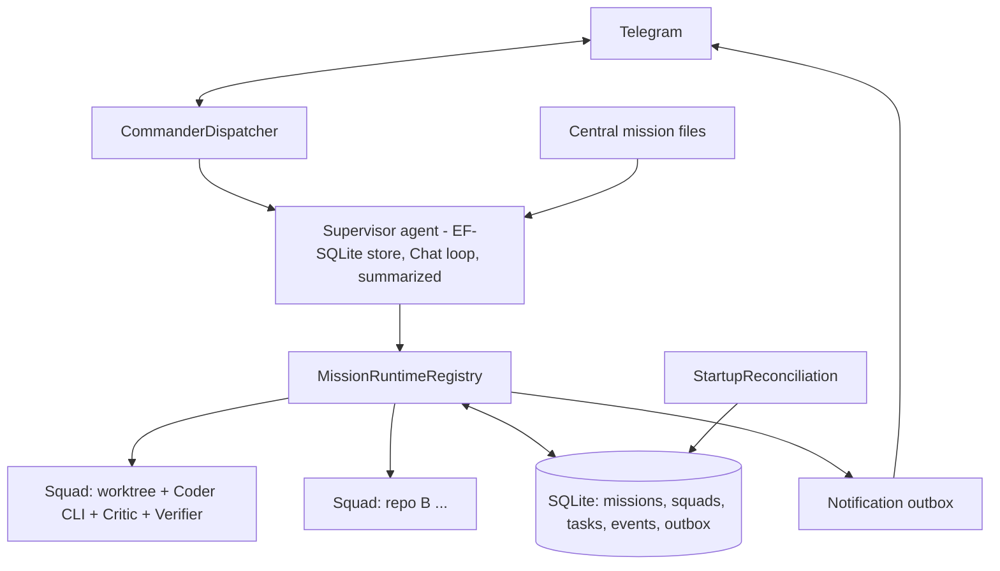

# DevCommander — Software Requirements Specification

**Version:** 1.0 (locked) · **Date:** 2026-07-14 · **Status:** Approved for build
**Stack:** .NET 10 · NovaCore.Agents v3.1 · SQLite · Docker on home server (JobAssistant deployment model)

---

## 1. Purpose & Scope

DevCommander is a personal autonomous-coding control plane. The human commander talks only to a supervisor agent over Telegram; the supervisor decomposes locked missions, spawns disposable coding-CLI workers per repository, runs a Coder→Critic→Verifier loop, and notifies the commander on completions and blockers only.

**In scope:** mission orchestration, multi-repo squads, four coding runtimes, durability/recovery, approval gates, notifications.
**Out of scope:** writing missions (human authored), CI/CD, PR review UI, multi-user tenancy, MCP integrations, container-per-task sandboxing.

## 2. Stakeholders

| Role | Who | Interaction |
|---|---|---|
| Commander | You | Telegram only: goals, questions, `/approve`, course-correction |
| Supervisor agent | NovaCore orchestrator | Only entity the commander talks to |
| Squads | Ephemeral CLI workers | Never addressed directly by the human |

## 3. System Context

- **Host:** home server, Docker, single container + SQLite file volume (JobAssistant model). Repos are **cloned on the server** under a data root; results reach you via pushed branches. The container image includes: dotnet SDK, git, `claude`, `codex`, `cursor-agent`, `opencode` CLIs and their credentials.
- **Reference implementations reused:** `TelegramPollingService`, `OrchestratorDispatcher`, `ApplicationRuntimeRegistry`, `StartupReconciliationService` patterns from JobAssistant; `RunBudget`, `SuspendsForHost`, `RunStructuredAsync<T>`, EF/store bindings from NovaCore.Agents (swap EF SQL Server for SQLite provider).
- **Pilot repos:** `Wincora.Infrastructure`, `Wincora.Nexus`.
- **Mission source:** central — `{DataRoot}/missions/{repoId}/{missionId}.md` + index. Repos keep only `AGENTS.md`.

## 4. Architecture

**Components:** CommanderDispatcher (C1) · Supervisor factory `"commander"` (C2) · MissionRuntimeRegistry (C3) · Runtime adapters `claude|codex|cursor|opencode` (C4) · CriticCapability (C5) · VerifierCapability (C6) · StartupReconciliationService (C7) · Notification outbox (C8) · SQLite/EF store (C9) · Model profiles (C10).

**Squad loop:** worktree → Coder (CLI subprocess, receives `AGENTS.md` + mission file + pending tasks) → Critic (one-shot structured verdict on `git diff`) → Verifier (`dotnet build/test`, machine truth) → retry on fail (bounded) → commit/push + notify on pass.

## 5. Functional Requirements

**Missions & planning**
- FR-001: Register a repo (path/clone URL, default runtime, verification commands) via Telegram command.
- FR-002: Create a mission only from a locked mission file; refuse spawn if the file is missing or incomplete (BR-001).
- FR-003: Decompose a mission into `TaskItem`s persisted before any worker spawns.
- FR-004: Run squads for independent repos in parallel; dependent phases sequentially with upstream summaries as downstream context.

**Execution**
- FR-010: Spawn the coder as a headless CLI subprocess (`claude -p` / `codex exec --json` / `cursor-agent` / `opencode`) in a dedicated git worktree and branch.
- FR-011: Select runtime per repo from registry; allow per-mission override.
- FR-012: After each coder attempt, run Critic and return a structured verdict `{approved, blockingFindings[], notes}`.
- FR-013: After Critic approval, run the repo's verification commands; treat exit code as sole pass signal.
- FR-014: On verification failure, re-invoke the coder with critic findings + test output, up to the attempt cap.
- FR-015: On pass, commit, push the mission branch, mark tasks done with evidence, and emit a completion notification.

**Command & control**
- FR-020: Answer commander status queries from durable state (not worker context).
- FR-021: Support `StopSquad` (kill process, keep worktree + state) and `ContinueMission` (resume from ledger).
- FR-022: Gate configured destructive operations (deploy, `pulumi up`, force push) behind `SuspendsForHost` → explicit `/approve` in Telegram.

**Durability & recovery**
- FR-030: Persist mission graph, task ledger, squad status, events, and notification outbox in SQLite; agent conversations are ephemeral.
- FR-031: On startup, reconcile: reload missions, detect dead PIDs, respawn coders with `git diff` + pending tasks, notify commander of lost runs.
- FR-032: On network loss, mark squads `stalled_network`, retry with backoff, queue notifications in the outbox and flush on reconnect.
- FR-033: Use each runtime's native resume (`codex exec resume`, `claude --continue`, `Agent.resume`) when a session id survives; otherwise fresh-spawn from ledger.

**Notifications**
- FR-040: Notify only on: mission complete, blocked/approval needed, retries exhausted, budget/wall-time breach, post-recovery summary. Everything else logs to `SquadEvent`.

## 6. Business Rules

- BR-001: A mission file is valid only with all six sections: Goal, In-scope, Out-of-scope, Verification commands, Acceptance criteria, Runtime preference.
- BR-002: No worker may run outside its assigned worktree.
- BR-003: Coder attempts per task ≤ 3; same error signature twice → escalate to human.
- BR-004: A mission halts when `RunBudget.MaxCostUsd` or wall-time cap is hit; partial work is preserved.
- BR-005: Verifier exit code overrides any LLM self-assessment of "done."
- BR-006: Gated operations never execute without a recorded `/approve` (audit row).
- BR-007: DevCommander never pushes to `main`/`master`; mission branches only.
- BR-008: The supervisor never edits code itself — delegation only.

## 7. Non-Functional Requirements

| ID | Requirement | Target |
|---|---|---|
| NFR-01 | Recovery: unfinished missions resumable after crash/restart | 100% of missions resumable; zero completed-task rework |
| NFR-02 | Reconciliation time on boot | < 60 s to first status notification |
| NFR-03 | Commander query latency (status from DB) | < 5 s |
| NFR-04 | Supervisor context cost | Summarization ≥ every 10 turns; keep 10 recent (JobAssistant config) |
| NFR-05 | Cost ceiling | Per-mission `MaxCostUsd` mandatory; default $5, configurable |
| NFR-06 | Concurrency | ≥ 3 parallel squads without interference (worktree isolation) |
| NFR-07 | Observability | Every squad action → `SquadEvent` row; NovaCore OTel exporter optional |
| NFR-08 | Security | Telegram chat-id allowlist; CLI credentials in container env, never in DB/git; gated ops audited |
| NFR-09 | Availability | Daemon survives internet loss indefinitely; only workers require connectivity |

## 8. Data Model

| Entity | Fields (key) |
|---|---|
| `Repo` | Id, ClonePath, DefaultRuntime, VerifyCommands, GatedOps |
| `Mission` | Id, RepoId, SpecPath, Status, BudgetUsd, Branch, CreatedAt/ClosedAt |
| `Squad` | Id, MissionId, WorktreePath, Runtime, Status, LastPid, SessionId, AttemptCount |
| `TaskItem` | Id, MissionId, Description, Status(pending/done/failed), Evidence |
| `SquadEvent` | Id, SquadId, Kind, Payload, At |
| `Notification` | Id, Severity, Body, State(queued/sent), At |
| `ApprovalRequest` | Id, MissionId, Operation, State, DecidedAt |
| + NovaCore `agent_sessions`/`agent_messages` (supervisor chat only) |

## 9. External Interfaces

| Interface | Contract |
|---|---|
| Telegram bot | Commands: `/missions`, `/status {id}`, `/approve {id}`, `/stop {id}`, `/continue {id}`; free text → supervisor turn |
| Runtime adapter | `IRuntimeAdapter { Start(spec, worktree, ct) → StreamedResult{sessionId, finalMessage, exitCode}; Resume(sessionId, prompt, ct) }` — four implementations |
| Verifier | Shell exec of `Repo.VerifyCommands`; stdout/stderr captured as evidence |
| Git | worktree add/remove, commit, push; branch naming `mission/{repoId}/{missionId}` |

## 10. Key Workflows

1. **Happy path:** mission file authored → `/start mission` → decompose → squad loop → verify pass → push + notify.
2. **Blocked:** coder needs a decision → `SuspendsForHost` → Telegram ping → your reply resumes the same squad (or fresh-spawn after restart, JobAssistant hybrid-resume pattern).
3. **Crash:** container restarts → reconciliation → dead PIDs detected → respawn from ledger + `git diff` → "resumed 2 squads, lost 0 tasks" notification.
4. **Runaway:** attempt cap or budget breach → squad halted, partial preserved → escalation ping.

## 11. Acceptance Criteria (samples; one per FR at build time)

- **FR-002:** Given a mission file missing "Verification", when `/start` is issued, then no squad spawns and the supervisor replies naming the missing section.
- **FR-013/BR-005:** Given the coder reports success but `dotnet test` exits non-zero, then the task stays failed and a retry begins.
- **FR-031:** Given a squad killed by `kill -9` and container restart, when the daemon boots, then the mission resumes with completed `TaskItem`s untouched and the commander receives a recovery summary within 60 s.
- **FR-022/BR-006:** Given a mission reaching `pulumi up`, then execution suspends and proceeds only after `/approve`, with an `ApprovalRequest` row recorded.

## 12. Constraints & Assumptions

- Confirmed: home server + Docker + SQLite; runtimes = claude + codex + cursor CLI + opencode; approval gates on; central missions; pilots = Infrastructure + Nexus.
- `[INFERRED]` Container is Linux (JobAssistant Dockerfile model); all four CLIs and dotnet SDK run in it. Basis: JobAssistant deployment; workstation-native execution was superseded by answer #1.
- `[INFERRED]` Cursor CLI in headless/non-interactive mode is acceptable on Linux server; if a runtime misbehaves headless on Linux, per-repo runtime choice routes around it.
- `[INFERRED]` One commander user; multi-user isolation (JobAssistant's principal-per-tenant) is not required — principal still carries mission id for budgets.

## 13. Architectural Decisions

ADR-001 NovaCore over CAF (Accepted) · ADR-002 Workers as external CLI subprocesses (Accepted) · ADR-003 Three-store durability: SQLite + git + task ledger (Accepted) · ADR-004 Critic = one-shot structured NovaCore agent, readonly-CLI escalation optional (Accepted) — full text in prior message, carried unchanged. **New: ADR-005 SQLite over SQL Server (Accepted)** — single-user, single-node; EF provider swap; removes an external service.

## 14. Open Questions

| # | Question | Owner | Blocking? | Default |
|---|---|---|---|---|
| OQ-1 | Do Cursor CLI and OpenCode support fully non-interactive auth inside a headless Linux container? | Vendor docs / spike test | Non-blocking (start with claude+codex) | Ship claude+codex first; add others after spike |
| OQ-2 | Codex/Claude subscription vs API-key billing from a server container | Provider ToS | Non-blocking | API keys in container env |

**Quality gate:** all FRs atomic and traceable to the goal; all NFRs numeric; inferences tagged; no open question owned by you.

---

**Recommended build order (thin slices):** ① C1+C2+C9 — supervisor chat + mission CRUD → ② C3+C4(claude)+C6 — one squad, Coder→Verifier on `Wincora.Infrastructure` → ③ C5 critic + retry loop → ④ C7 reconciliation + C8 outbox → ⑤ remaining runtimes + parallel squads + approval gates.

Save target when you switch to Agent mode: `{DataRoot}/docs/devcommander-srs.md` (created, not updating any existing doc).
